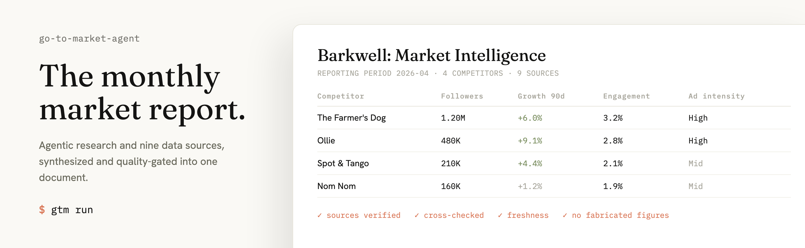

<p align="center">
  <picture>
    <source media="(prefers-color-scheme: dark)" srcset="assets/banner-dark.png">
    
  </picture>
</p>

# go-to-market-agent

go-to-market-agent is a multi-agent engine that turns agentic web research and nine
enrichment sources into a monthly competitive and market-intelligence report, with every
section cleared by deterministic and LLM quality gates before it ships. The model interprets
the data; it does not invent it.

[](https://github.com/maxrihter/go-to-market-agent/actions/workflows/ci.yml)

[](LICENSE)
[](pyproject.toml)
[](https://github.com/astral-sh/ruff)

You describe a brand and its competitor watchlist once in YAML. The engine researches the
web, enriches competitors from up to nine data sources, writes facts-only sections,
synthesizes a scoreboard and ICE-scored recommendations, and clears a two-stage quality gate
before publishing to Markdown and JSON. It is the generalized form of a system run in
production; the example tenant is a fictional US dog-food brand, Barkwell.

## Quickstart

The demo runs the entire pipeline on bundled fixtures, with no API keys and no network.

```bash
git clone https://github.com/maxrihter/go-to-market-agent && cd go-to-market-agent
make install      # uv sync --extra dev
make demo         # full pipeline on fixtures; no keys, no network
```

It writes a complete report to `output/`. The committed sample is in
[docs/sample-report.md](docs/sample-report.md).

<p align="center">
  
</p>

## How it works


A research supervisor delegates web research per section; six analysts write facts-only
sections from the findings and the enriched competitor data; three synthesizers interpret
them into a scoreboard, an executive summary, and ICE-scored recommendations; the report is
assembled and then cleared by deterministic gates and an LLM reviewer before it renders.

- Data is sourced, not invented. Competitor metrics come from the enrichment sources,
  fabricated source URLs are dropped, and stale sizing years are rejected.
- The gate is two-stage. Deterministic checks (completeness, coverage, tautology, evidence
  chain, freshness, forbidden entities) plus an LLM reviewer decide what publishes; a rejected
  report is never persisted.
- The LLM layer degrades gracefully. Every role runs a primary, then fallback, then
  retry-with-hint chain, so one empty or malformed response does not fail the run.

The node-by-node design is in [docs/ARCHITECTURE.md](docs/ARCHITECTURE.md).

## Features

- Config-driven. Brand, niche, watchlist, and safety lists live in one `tenant.yaml`;
  retargeting needs no code changes.
- Multi-agent orchestration on LangGraph: a research subgraph, six analysts, three
  synthesizers, and a two-stage publish gate.
- Nine-source competitor enrichment: Instagram, Meta Ad Library, SimilarWeb, Wayback, Google
  Trends, YouTube, App Store, Ahrefs, and DataForSEO.
- Provider-agnostic LLM router (Anthropic, any OpenAI-compatible endpoint, Mistral, Google)
  with a primary, fallback, and retry path per role.
- Quality gates plus an LLM pre-publish reviewer that can reject a report, and an evaluation
  harness (`gtm eval`) that scores grounding, completeness, traceability, and clarity.
- Plugin architecture for new sources, analysts, synthesizers, gates, outputs, and providers;
  month-over-month history in local SQLite; a hermetic demo that runs with no keys.

## Running live

```bash
cp .env.example .env      # add one LLM key, plus TAVILY_API_KEY and APIFY_TOKEN
gtm init                  # scaffolds config/tenant.yaml from the bundled example
$EDITOR config/tenant.yaml
gtm run --month 2026-05   # writes output/<report_id>.md and .json
```

A live run needs one LLM key and a Tavily key for research; competitor enrichment uses an
Apify token, and the paid SEO sources (Ahrefs, DataForSEO) are optional. Every config field is
documented in [docs/CONFIGURATION.md](docs/CONFIGURATION.md); the operational playbook is in
[docs/SETUP.md](docs/SETUP.md).

## Extending

Each extension point is a small protocol plus a registry; ship a plugin or drop one in-tree.
Add a Source (a data connector), an Analyst (a report section), or a Synthesizer, Gate,
OutputAdapter, or LLMProvider. Run `gtm plugins list` to see what is registered. Details in
[docs/EXTENDING.md](docs/EXTENDING.md).

## Architecture

| Layer | Technology |
|---|---|
| Orchestration | LangGraph (typed multi-node graph, subgraphs, checkpointing) |
| LLM access | Provider-agnostic router over LangChain provider SDKs, structured output |
| Data models | Pydantic v2 |
| Research and enrichment | Tavily, Apify, and per-source clients |
| Storage | SQLite by default, Postgres optional |
| CLI | Typer and Rich |
| Tooling | uv, ruff, mypy, pytest |

Full node-by-node design, resilience, and the gate model: [docs/ARCHITECTURE.md](docs/ARCHITECTURE.md).

## Security and data handling

- Report figures come from the enrichment sources; fabricated URLs are dropped and a report
  reaches `output/` only after clearing the gates and the LLM reviewer.
- Secrets are read from `.env` only; nothing sensitive is committed and `.env.example` ships
  empty placeholders. State is local SQLite by default.
- Generalized from a private system with all client data, names, and strategy removed; the
  only brand present is the fictional Barkwell.

## Documentation

| Document | Contents |
|---|---|
| [SETUP.md](docs/SETUP.md) | Live-run playbook: keys, enrichment sources, scheduling |
| [CONFIGURATION.md](docs/CONFIGURATION.md) | Every `tenant.yaml` field |
| [EXTENDING.md](docs/EXTENDING.md) | Adding a source, analyst, gate, output, or provider |
| [ARCHITECTURE.md](docs/ARCHITECTURE.md) | Node-by-node design, resilience, and the gate model |

## Contributing

Issues and pull requests are welcome; see [CONTRIBUTING.md](CONTRIBUTING.md). Run
`make lint && make test` first (mocked, no keys required).

## License

[MIT](LICENSE) © Max Romanov. Built by Max Romanov ([GitHub](https://github.com/maxrihter)).
