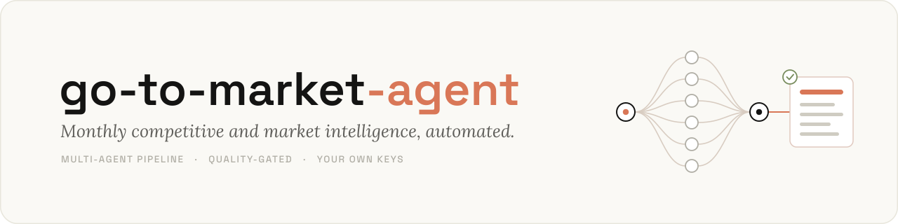
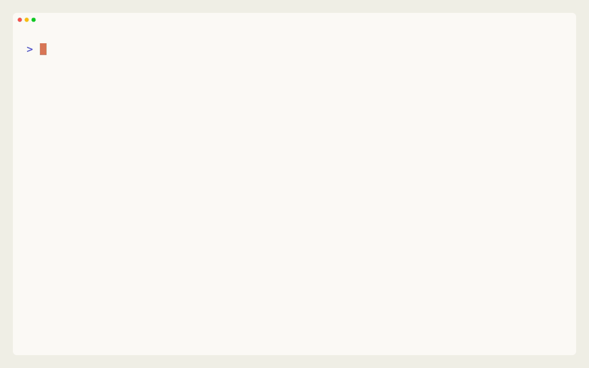
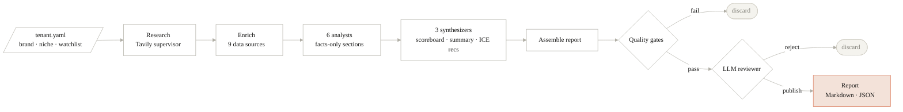

<p align="center">
  
</p>

# go-to-market-agent

A config-driven, multi-agent engine that turns agentic web research and multi-source data
into a monthly competitive and go-to-market report, with every section checked by quality
gates before it ships.

[](https://github.com/maxrihter/go-to-market-agent/actions/workflows/ci.yml)

[](https://github.com/langchain-ai/langgraph)
[](LICENSE)
[](pyproject.toml)
[](https://github.com/astral-sh/ruff)
[](https://mypy-lang.org/)

## Overview

Monthly competitive and go-to-market reporting is slow and hard to trust. Someone gathers
market sizing, competitor moves, consumer signals, and tech trends, then turns them into a
brief that is stale by the time it lands. go-to-market-agent runs that work as a multi-agent
pipeline. You describe the brand and its watchlist once in YAML; the engine researches the
web, enriches competitors from up to nine sources, writes facts-only sections, synthesizes a
KPI scoreboard and ICE-scored recommendations, and clears deterministic and LLM quality
gates before publishing. It is the generalized form of a system run in production; the example
tenant is a fictional US dog-food brand, Barkwell.

## Quickstart

The demo runs the entire pipeline on bundled fixtures, with no API keys and no network.

```bash
git clone https://github.com/maxrihter/go-to-market-agent && cd go-to-market-agent
make install      # uv sync --extra dev
make demo         # full pipeline on fixtures; no keys, no network
```

It writes a complete report to `output/`. The committed sample is in
[docs/sample-report.md](docs/sample-report.md).

<p align="center">
  
</p>

## How it works



A research supervisor delegates web research per section; six analysts write facts-only
sections from the findings and the enriched competitor data; three synthesizers interpret
them into a scoreboard, an executive summary, and recommendations; the report is assembled and
then cleared by quality gates and an LLM reviewer before it renders.

- The model interprets data; it does not supply it. Competitor metrics come from the
  enrichment sources, fabricated source URLs are dropped, and stale sizing years are rejected.
- Quality gates are explicit. Deterministic checks (completeness, coverage, tautology,
  evidence chain, freshness, forbidden entities) plus an LLM reviewer decide what is fit to
  publish; a rejected report is never persisted.
- Every LLM role runs a primary, then fallback, then retry-with-hint chain, so one empty or
  malformed response degrades gracefully instead of failing the run.

The node-by-node design is in [docs/ARCHITECTURE.md](docs/ARCHITECTURE.md).

## Features

- Config-driven. Brand, niche, watchlist, and safety lists live in one `tenant.yaml`;
  retargeting needs no code changes.
- Multi-agent orchestration on LangGraph: a research subgraph, six analysts, three
  synthesizers, annotators, and a two-stage publish gate.
- Multi-source competitor fusion across nine sources: Instagram, Meta Ad Library, SimilarWeb,
  Wayback, Google Trends, YouTube, App Store, Ahrefs, and DataForSEO.
- Provider-agnostic LLM router. Anthropic and any OpenAI-compatible endpoint (OpenAI, a local
  Ollama, imago.market) are built in; Mistral and Google are optional extras.
- Quality gates plus an LLM pre-publish reviewer that can reject a report.
- Evaluation harness (`gtm eval`) that scores a report on grounding, completeness,
  traceability, and clarity.
- Plugin architecture: add a source, analyst, synthesizer, gate, output, or LLM provider
  without forking the core.
- Month-over-month intelligence and human-in-the-loop corrections, backed by local SQLite
  (Postgres optional).
- A hermetic demo that runs the full pipeline with no keys and no network.

## How it compares

| | A human analyst or agency | Generic AI chat | go-to-market-agent |
|---|---|---|---|
| Multi-source competitor data | Gathered by hand | None | Fused from nine sources |
| Figures in the report | Real, pulled manually | Often invented | From the sources; fabrications dropped |
| Trust mechanism | Reviewer judgement | None | Deterministic gates plus an LLM reviewer |
| Output | A deck, over days | A text answer | A structured report, repeatably |
| Cost | High: retainer or salary | Low and flat | API and scraping usage only |
| Scaling to more brands or regions | Hire more people | Not applicable | Add a config file |

It covers the research and drafting layer, not the whole job. A person still owns the
decision and the relationships; the engine makes sure they start with the groundwork done.

## Configuration

```bash
gtm init                  # scaffolds config/tenant.yaml from the bundled example
$EDITOR config/tenant.yaml
```

A tenant is plain data: brand and region, the niche, a competitor watchlist, forbidden-entity
and safety lists, and per-role LLM routing. Every field is documented in
[docs/CONFIGURATION.md](docs/CONFIGURATION.md); prompts in `src/gtm_agent/prompts/*.txt` carry
`# ADD: your ...` markers for what to tailor.

## Running live

```bash
cp .env.example .env      # add one LLM key, plus TAVILY_API_KEY and APIFY_TOKEN
gtm run --month 2026-05   # writes output/<report_id>.md and .json
```

A live run needs one LLM key and a Tavily key for research; competitor enrichment uses an
Apify token, and the paid SEO sources (Ahrefs, DataForSEO) are optional. The operational
playbook is in [docs/SETUP.md](docs/SETUP.md).

## Extending

Each extension point is a small protocol plus a registry; ship a plugin or drop one in-tree.

- Source: a new data connector (for example Reddit or review sites).
- Analyst: a new report section.
- Synthesizer, Gate, OutputAdapter, LLMProvider: new interpretation, checks, formats, models.

Run `gtm plugins list` to see what is registered. Details in
[docs/EXTENDING.md](docs/EXTENDING.md).

## Evaluation

```bash
gtm eval                  # scores the latest report
```

The harness combines a deterministic floor (the publish gates) with an LLM judge scoring
grounding, completeness, traceability, and clarity. It runs offline on the deterministic part
and adds the judge scores when an LLM key is present.

## Architecture

```
go-to-market-agent/
  src/gtm_agent/
    cli.py                # init / run / demo / eval / plugins / version
    config.py             # tenant settings (brand, niche, watchlist, safety, LLM)
    engine/
      graph.py            # LangGraph wiring
      pipeline.py         # entrypoint and dependency injection
      research/           # Tavily research supervisor + researcher subgraph
      nodes/              # analysts, synthesizers, enrichment, QA gates, assembly
      demo.py             # hermetic, no-keys demo
    integrations/         # source clients + output adapters (markdown; html and notion are seams)
    llm/router.py         # provider-agnostic, resilient LLM router
    models/               # Pydantic v2 schemas
    plugins/              # extension protocols + registry
    prompts/ templates/   # system prompts (.txt) and the bundled example tenant
    storage/              # SQLite store and checkpointer
  docs/  tests/
```

| Layer | Technology |
|---|---|
| Orchestration | LangGraph (typed multi-node graph, subgraphs, checkpointing) |
| LLM access | Provider-agnostic router over LangChain provider SDKs, structured output |
| Data models | Pydantic v2 |
| Research + enrichment | Tavily, Apify, and per-source clients |
| Storage | SQLite by default, Postgres optional |
| CLI | Typer and Rich |
| Tooling | uv, ruff, mypy, pytest |

## Security and data handling

- Report figures come from the enrichment sources; fabricated URLs are dropped and stale
  sizing years are rejected.
- A report reaches `output/` only after clearing the deterministic gates and the LLM reviewer.
- Secrets are read from `.env` only; nothing sensitive is committed and `.env.example` ships
  empty placeholders.
- State is local SQLite by default.
- Generalized from a private system with all client data, names, and strategy removed; the
  only brand present is the fictional Barkwell.

## Development

```bash
make install     # uv sync --extra dev
make test        # pytest -q; mocked, no keys required
make lint        # ruff check and mypy
make fmt         # ruff format and autofix
```

Python 3.11+, fully typed, async I/O throughout. The test suite is mocked and runs offline.

## Documentation

| Document | Contents |
|---|---|
| [SETUP.md](docs/SETUP.md) | Live-run playbook: keys, enrichment sources, scheduling |
| [CONFIGURATION.md](docs/CONFIGURATION.md) | Every `tenant.yaml` field |
| [EXTENDING.md](docs/EXTENDING.md) | Adding a source, analyst, gate, output, or provider |
| [ARCHITECTURE.md](docs/ARCHITECTURE.md) | Node-by-node design, resilience, and the gate model |

## Author

Built by Max Romanov. I build production multi-agent LLM systems; this is the open-source
generalization of one. More work is on [GitHub](https://github.com/maxrihter), including
[imago](https://imago.market), an LLM marketplace. Available for AI and LLM consulting.

## Contributing

Issues and pull requests are welcome; see [CONTRIBUTING.md](CONTRIBUTING.md). Run
`make lint && make test` first.

## License

[MIT](LICENSE) © Max Romanov
